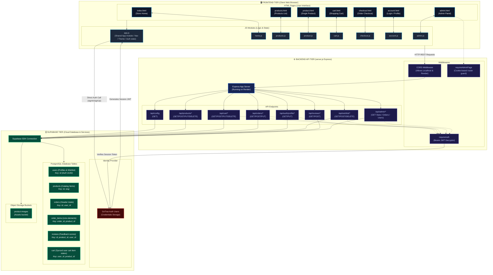
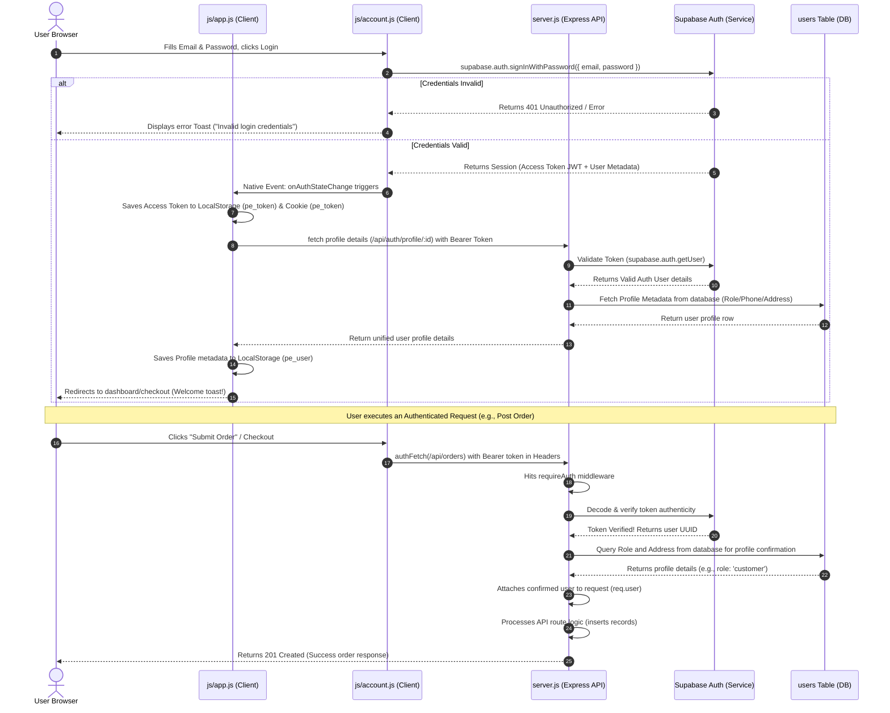

# Electronic World — Application Architecture & Data Flow

This document provides a comprehensive map of the **Electronic World** e-commerce application architecture, tracing how the frontend pages, script modules, backend API endpoints, authentication mechanisms, and database structures connect.

---

## 📐 System Architecture Diagram

Below is the complete system diagram showing components grouped by tier, the data routes, and authentication flows:

---

## 🔒 Authentication Flow

Below is a detailed sequence of how users are authenticated and how roles (such as Admin privileges) are checked securely on both the client and the server:

---

## 🔄 Data Lifecycle & Flow Map

### 1. Catalog Browsing & Live Autocomplete Search
* **Trigger**: A visitor types in the navigation bar search input ([js/app.js](file:///d:/patra%20trail/js/app.js)).
* **Flow**:
  1. Input event triggers a debounced HTTP request to `/api/products?search=<query>` on the Express backend.
  2. The Express server executes a query against the Supabase `products` table using `.or()` filters (matching on name, category, or brand).
  3. PostgreSQL returns matching records. The backend enriches the products (calculating discounts and stock statuses) and returns JSON.
  4. The frontend renders matching cards dynamically inside a floating autocomplete dropdown.
  5. The visitor clicks a card, transforming the name slug, and redirects to `/product/<slug>`.

### 2. Wishlist Management (Embedded Address Field)
* **Design Decision**: Instead of creating a separate relational table for Wishlists, items are saved inside a sub-array inside the stringified `address` JSON field in the `users` profile table.
* **Add to Wishlist**:
  1. User clicks the heart button on a product card.
  2. Frontend sends a `POST` request to `/api/wishlist/:userId` with the `productId`.
  3. Express loads the user's profile from the `users` table, parses the `address` JSON string, appends the new `productId` to `address.wishlist` array, stringifies it back, updates the row, and returns the updated ID array to the client.

### 3. Shopping Cart Sync
* **Design Decision**: Carts are synced locally for guest accounts using `localStorage` (`pe_cart`), and synchronized on the database when logged in.
* **Database Cart Operations**:
  1. User adds/updates items in the cart.
  2. Frontend fires `POST` / `PUT` / `DELETE` requests to `/api/cart/:userId/*`.
  3. Express performs database inserts/updates/deletions on the `cart` table in Supabase.
  4. Live cart counts are updated on the navbar badge.

### 4. Checkout and Ordering Process
* **Trigger**: User completes checkout form on [checkout.html](file:///d:/patra%20trail/checkout.html).
* **Flow**:
  1. Frontend submits order details to `POST /api/orders`.
  2. **RequireAuth** middleware confirms session.
  3. Express starts the transaction sequence:
     - Inserts order header details into the `orders` table.
     - Maps and inserts line items into the `order_items` table.
     - Clears the user's synced database cart items in the `cart` table.
  4. Response is returned to the client, which clears local cart storage and redirects to the account page to track the new order delivery.
